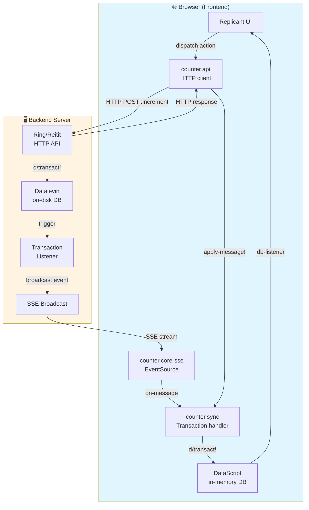
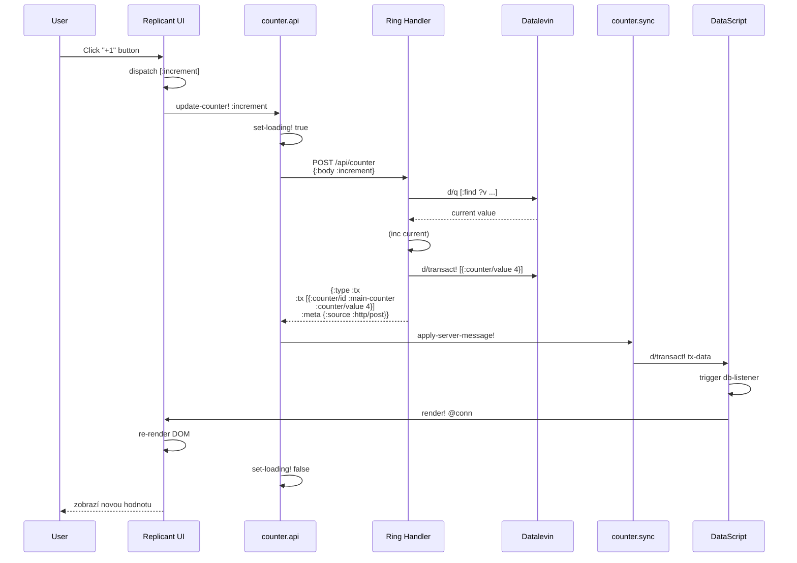
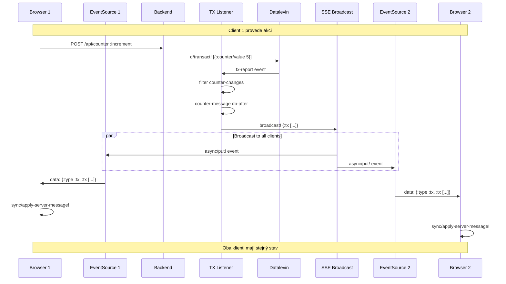
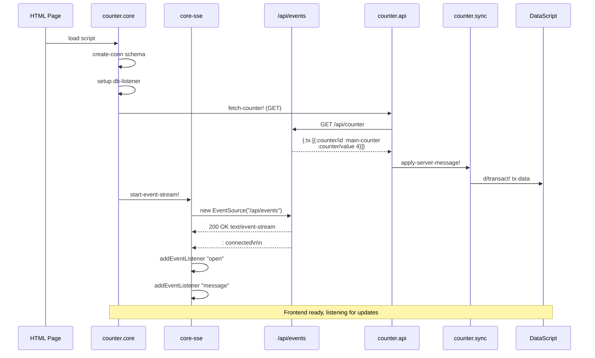
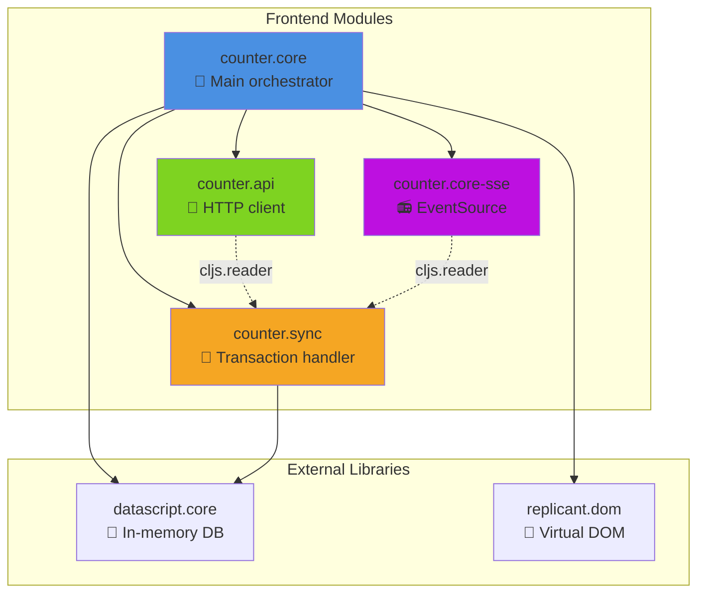
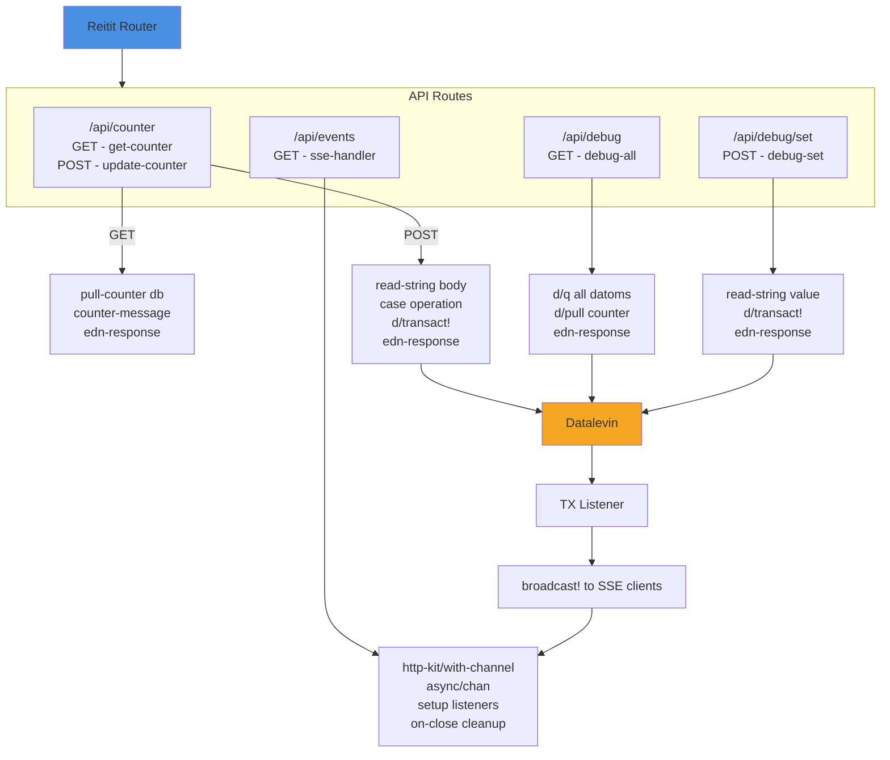

# Architektura DataScript Counter App

## Přehled Systému



## 1. Data Flow - User Initiated Action



## 2. Real-time Synchronization via SSE



## 3. Frontend Initialization & Connection Setup



## 4. EDN Communication Protocol

```mermaid
graph LR
    subgraph Frontend
        A[User Action] -->|keyword| B[API Module]
        B -->|pr-str| C[":increment"]
    end
    
    subgraph Transport
        C -->|HTTP POST| D[Network]
        D -->|text/plain| E[Backend]
    end
    
    subgraph Backend_Process[Backend]
        E -->|read-string| F[":increment keyword"]
        F -->|case| G[Logic]
        G -->|d/transact!| H[Datalevin]
        H -->|counter-message| I["{:type :tx<br/>:tx [...]<br/>:meta {...}}"]
        I -->|pr-str| J["String EDN"]
    end
    
    subgraph Response
        J -->|HTTP 200| K[Network]
        K -->|.text| L[Frontend]
        L -->|cljs.reader/read-string| M[Clojure Map]
        M -->|apply-message!| N[DataScript]
    end
    
    style Frontend fill:#e1f5ff
    style Backend_Process fill:#fff4e1
    style Transport fill:#f0f0f0
    style Response fill:#e8f5e9
```



## 5. Database Schema & Queries

```mermaid
graph TB
    subgraph Backend_Schema["Backend Schema (Datalevin)"]
        B1[":counter/id<br/>{:db/unique :db.unique/identity<br/>:db/valueType :db.type/keyword}"]
        B2[":counter/value<br/>{:db/valueType :db.type/long}"]
    end
    
    subgraph Frontend_Schema["Frontend Schema (DataScript)"]
        F1[":counter/id<br/>{:db/unique :db.unique/identity}"]
        F2[":counter/value<br/>(implicit)"]
        F3[":counter/loading<br/>(UI-only state)"]
    end
    
    subgraph Entity["Entity Example"]
        E["{:counter/id :main-counter<br/>:counter/value 4<br/>:counter/loading false}"]
    end
    
    subgraph Query["DataLog Query"]
        Q["[:find ?value ?loading<br/>:in $ ?id<br/>:where<br/>[?e :counter/id ?id]<br/>[?e :counter/value ?value]<br/>[?e :counter/loading ?loading]]"]
    end
    
    Backend_Schema -.->|sync via {:tx [...]}| Frontend_Schema
    Entity -.-> Backend_Schema
    Entity -.-> Frontend_Schema
    Frontend_Schema --> Query
    
    style Backend_Schema fill:#fff4e1
    style Frontend_Schema fill:#e1f5ff
```

## 6. Module Dependencies



## 7. Backend Handlers & Routing



## 8. Error Handling & Reconnection

```mermaid
stateDiagram-v2
    [*] --> Disconnected
    
    Disconnected --> Connecting: start-event-stream!
    Connecting --> Connected: EventSource "open"
    Connected --> Receiving: listening for messages
    
    Receiving --> Processing: event.data received
    Processing --> Receiving: success
    Processing --> ParseError: cljs.reader/read-string fails
    ParseError --> Receiving: log error, continue
    
    Connected --> NetworkError: connection lost
    NetworkError --> Cleanup: close EventSource
    Cleanup --> Waiting: reset! event-source nil
    Waiting --> Connecting: setTimeout 3000ms
    
    Receiving --> Stopped: stop-event-stream!
    Connected --> Stopped: stop-event-stream!
    Stopped --> [*]
```



## 9. Transaction Lifecycle

```mermaid
flowchart TD
    START([User Click]) --> DISPATCH{Replicant<br/>Dispatch}
    DISPATCH --> ACTION[Action: :increment]
    ACTION --> LOADING1[Set loading: true]
    
    LOADING1 --> HTTP[HTTP POST<br/>/api/counter<br/>body: :increment]
    
    HTTP --> BACKEND_READ[Backend:<br/>d/q current value]
    BACKEND_READ --> CALC[Calculate:<br/>new-value = inc current]
    CALC --> BACKEND_TX[Backend:<br/>d/transact!]
    
    BACKEND_TX --> TRIGGER[Trigger TX Listener]
    TRIGGER --> BROADCAST[Broadcast SSE]
    
    BACKEND_TX --> RESPONSE[HTTP Response:<br/>{:tx [...]}]
    RESPONSE --> PARSE[Parse EDN]
    PARSE --> SYNC[counter.sync/<br/>apply-server-message!]
    
    SYNC --> DS_TX[DataScript:<br/>d/transact!]
    DS_TX --> LOADING2[Set loading: false]
    DS_TX --> LISTENER[DB Listener]
    LISTENER --> RENDER[Replicant render!]
    RENDER --> UI([UI Update])
    
    BROADCAST --> SSE_CLIENTS[Other SSE Clients]
    SSE_CLIENTS --> SYNC2[Their sync/<br/>apply-server-message!]
    SYNC2 --> DS_TX2[Their d/transact!]
    DS_TX2 --> RENDER2[Their UI update]
    
    style START fill:#4a90e2
    style UI fill:#7ed321
    style BACKEND_TX fill:#f5a623
    style BROADCAST fill:#bd10e0
```

## 10. Data Persistence

```mermaid
graph TB
    subgraph Memory["💾 In-Memory (Browser)"]
        DS[DataScript Connection<br/>defonce conn]
        ENTITY1["{:counter/id :main-counter<br/>:counter/value 4<br/>:counter/loading false}"]
    end
    
    subgraph Network["🌐 Network Transport"]
        EDN[EDN Messages<br/>"{:type :tx<br/>:tx [...]<br/>:meta {...}}"]
    end
    
    subgraph Disk["💿 On-Disk (Server)"]
        DL[Datalevin DB<br/>/opt/counter-app/data/datalevin-db]
        ENTITY2["{:counter/id :main-counter<br/>:counter/value 4}"]
    end
    
    DS -->|volatile| ENTITY1
    DL -->|persistent| ENTITY2
    
    ENTITY1 <-.->|HTTP/SSE| EDN
    EDN <-.->|HTTP/SSE| ENTITY2
    
    ENTITY1 -.->|lost on refresh| RELOAD([Page Reload])
    ENTITY2 -.->|survives| RESTART([Server Restart])
    
    style Memory fill:#e1f5ff
    style Network fill:#f0f0f0
    style Disk fill:#fff4e1
```

## Klíčové Principy

### 🔄 Synchronizace Stavu
- **Autoritativní zdroj**: Backend (Datalevin)
- **Replika**: Frontend (DataScript)
- **Protocol**: EDN přes HTTP/SSE
- **Consistency**: Eventual consistency via SSE broadcast

### 📡 Komunikační Kanály
1. **HTTP POST** - client → server akce
2. **HTTP GET** - initial state fetch
3. **SSE** - server → all clients broadcasts

### 🎯 Data Flow Pattern
```
UI Action → HTTP → Backend TX → DB → Listener → SSE Broadcast → All Clients
                          ↓
                    HTTP Response → Initiating Client
```

### 🧩 Separation of Concerns
- `counter.api` - transport layer (HTTP)
- `counter.sync` - synchronization logic
- `counter.core-sse` - SSE connection management
- `counter.core` - UI orchestration

### 💡 Why EDN?
- Native Clojure data structures
- Type preservation (keywords, symbols)
- No JSON serialization overhead
- Direct `read-string` / `pr-str`
